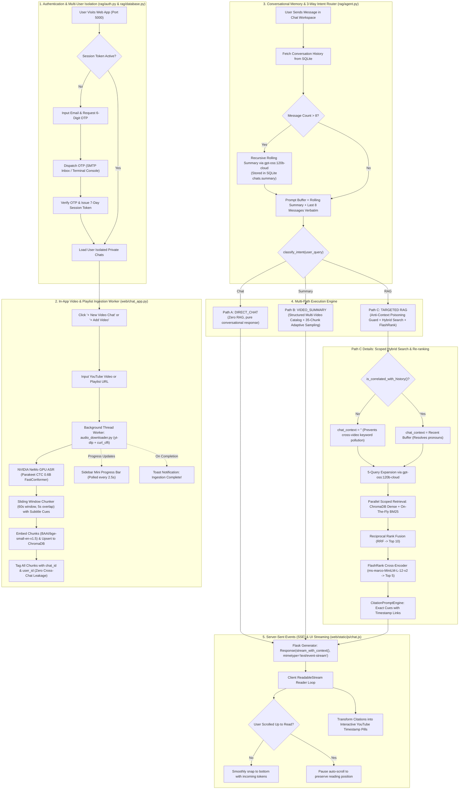

# Video Knowledge RAG: Production Multi-User Architecture & System Specification

An end-to-end, enterprise-grade **Video Knowledge Retrieval-Augmented Generation (RAG)** platform featuring per-chat video isolation, multi-user privacy with email OTP authentication, real-time Server-Sent Events (SSE) token streaming, a 3-way adaptive intent router, anti-context poisoning guard, an 8-message conversational buffer with recursive rolling summarization, in-app background YouTube video/playlist ingestion, and second-accurate YouTube timestamp citations.

---

## 1. High-Level System Architecture



---

## 2. Core Capabilities & Architectural Innovations

### 1. Per-Chat Video Isolation & Scoping
- Every chat is an independent workspace containing one or more YouTube videos or complete playlists.
- Dense queries in ChromaDB execute with strict boolean filters:
  ```python
  where = {"$and": [{"chat_id": chat_id}, {"user_id": user_id}]}
  ```
- Sparse keyword search builds a dynamic, lightweight **BM25Okapi index on-the-fly** strictly using the active chat's chunks.
- Chunks and queries never bleed across different chats or different users.

### 2. Multi-User Privacy & Zero Data Leakage
- Users authenticate with **Email & 6-digit OTP**.
- User sessions, chats, message histories, and vector chunks are strictly partitioned by `user_id`.
- User A can never view, search, or access videos, chunks, or conversations belonging to User B.

### 3. 3-Way Adaptive Intent Router & Workspace Awareness
The system analyzes every incoming message to determine the optimal response strategy:
1. **`DIRECT_CHAT`**: For greetings (*"hi"*, *"hello"*), thanks (*"thank you"*, *"got it"*), casual dialogue, and **workspace meta-questions** (*"how many videos are in this chat?"*, *"what videos do we have?"*, *"list the videos"*). Answered directly and accurately using the chat's registered video catalog without triggering RAG.
2. **`VIDEO_SUMMARY`**: Triggered when the user asks for a comprehensive summary, timeline, chapters, or key takeaways of the video.
3. **`RAG`**: For fact-seeking queries, technical questions, tool comparisons, or specific topics in the video.

### 4. Smart Duplicate Video & Playlist Prevention
When adding content via the **+ Add Video** modal:
- The system parses YouTube URLs across all formats (standard watch, shortened `youtu.be`, embeds, shorts, playlists).
- It validates whether the video or playlist is already indexed in the chat, was previously ingested as part of a playlist, or is currently processing.
- Rejects duplicate additions with HTTP 400 and renders clear, friendly feedback in the modal banner and toast notifications.

### 5. Ephemeral Structured Multi-Video Catalog & Adaptive Sampling
When `VIDEO_SUMMARY` is invoked:
- It compiles an in-memory structured catalog with video titles, YouTube URLs, and chronological segment transcripts.
- **Recursive Playlist Walk**: Automatically discovers nested playlist video folders (`op/<chat>/<playlist>/<video>/chunks.json`) so multi-video playlists load seamlessly.
- **Adaptive Downsampling**: If a video contains more than 35 chunks:
  $$\text{sample\\_step} = \max(1, \lfloor \text{len(chunks)} / 35 \rfloor)$$
  It evenly samples checkpoint segments across the start-to-finish timeline. This guarantees that chats with multiple long videos (e.g. 10 videos, 500+ chunks) fit safely into the LLM context window without VRAM spikes or slowdowns.

### 6. Anti-Context Poisoning Guard (`is_correlated_with_history`)
- Before expanding queries for RAG, the system checks whether the user's new question is semantically related to the previous dialogue turns.
- If the user changes topic or asks an independent question, `chat_context` is cleared (`""`), preventing keywords from previous videos from contaminating search results.

### 7. Real-Time Token Streaming with Smart Auto-Scroll Guard
- Responses are delivered token-by-token via **Server-Sent Events (SSE)**.
- The frontend [`chat.js`](file:///c:/Users/CT_USER/Desktop/Rag/web/static/js/chat.js) uses a `ReadableStream` reader with a blinking terminal cursor.
- **Auto-Scroll Guard**: If the user scrolls up to inspect previous answers, auto-scrolling automatically pauses so their view isn't yanked downward as new tokens arrive.

### 8. Immediate 8-Message Buffer + Recursive Rolling Summarization
- The **immediate last 8 messages** (4 conversational turns) are kept verbatim in the context prompt.
- Older messages beyond 8 turns are condensed into a rolling summary using `gpt-oss:120b-cloud` and stored in SQLite (`chats.summary`).
- Preserves deep historical context across 50+ conversational turns while keeping token usage bounded.

### 9. Exact Second-Level Timestamp Deep Links
- Subtitle cues preserve millisecond-accurate timestamps (`start_sec`, `end_sec`).
- Citations link directly to the exact second on YouTube (`&t=XXs`), preventing chunk-boundary inaccuracies.

---

## 3. Technical Module Breakdown

### 1. Persistence & SQLite Schema ([rag/database.py](file:///c:/Users/CT_USER/Desktop/Rag/rag/database.py))
SQLite database (`rag_app.db`) operating in WAL mode:
- `users`: `id`, `email`, `created_at`
- `otp_codes`: `id`, `email`, `code`, `expires_at`, `verified`
- `sessions`: `token`, `user_id`, `created_at`, `expires_at`
- `chats`: `chat_id`, `user_id`, `title`, `summary`, `created_at`, `updated_at`
- `chat_messages`: `id`, `chat_id`, `user_id`, `role`, `content`, `metadata_json`, `created_at`
- `chat_videos`: `id`, `chat_id`, `user_id`, `video_title`, `video_url`, `folder_name`, `chunk_count`, `cues_count`, `status`, `created_at`
- `ingest_jobs`: `job_id`, `chat_id`, `user_id`, `url`, `status`, `step`, `progress`, `logs_json`, `created_at`, `completed_at`

### 2. Authentication & Email OTP ([rag/auth.py](file:///c:/Users/CT_USER/Desktop/Rag/rag/auth.py))
- **OTP Generation**: Cryptographic 6-digit random code with 10-minute validity.
- **SMTP Sending**: Supports standard SMTP with STARTTLS (Port 587) or SSL (Port 465) via `.env`.
- **Console Fallback**: If SMTP is not configured, the verification code is printed securely to the backend server terminal console:
  `[AUTH OTP] User Email: {email} | Generated OTP: >>> {code} <<<`
- **Session Tokens**: 256-bit secure hex tokens stored in SQLite with 7-day validity and `rag_session` cookie support.

### 3. Scoped Vector Store & Hybrid Retriever ([rag/vectorstore.py](file:///c:/Users/CT_USER/Desktop/Rag/rag/vectorstore.py), [rag/retriever.py](file:///c:/Users/CT_USER/Desktop/Rag/rag/retriever.py))
- **Dense Vector Search**: ChromaDB HNSW cosine index (`BAAI/bge-small-en-v1.5`, 384 dimensions).
- **Sparse Lexical Search**: On-the-fly `BM25Okapi` index over the active chat's scoped corpus.
- **Reciprocal Rank Fusion (RRF)**: Merges dense and sparse ranks across 5 expanded queries into the Top 10 candidate chunks.
- **FlashRank Cross-Encoder**: Joint query-document attention (`ms-marco-MiniLM-L-12-v2`) extracts the definitive Top 5 precision chunks.

### 4. Conversational Agent & SSE Streaming ([rag/agent.py](file:///c:/Users/CT_USER/Desktop/Rag/rag/agent.py))
- `chat_scoped_stream(user_query, chat_id, user_id)`:
  - Fetches message history, buffers 8 messages, and maintains rolling summary.
  - Classifies intent via `classify_intent()`.
  - Dispatches to `DIRECT_CHAT`, `VIDEO_SUMMARY`, or `RAG`.
  - Yields streaming SSE events (`status`, `intent`, `token`, `done`, `error`).
  - Synthesizes grounded answers strictly using the chat's retrieved video cues and converts citations into clickable YouTube links.

---

## 4. Quick Start Guide

### 1. Prerequisites
- Python 3.10+ (Tested in Conda environment `testing`)
- Local Ollama running with `gpt-oss:120b-cloud` (`ollama run gpt-oss:120b-cloud`)
- NVIDIA GPU with CUDA support (for NeMo Parakeet ASR transcription)

### 2. Configure Email OTP (Optional for Live Inboxes)
To receive 6-digit login verification codes directly in your email inbox, configure your `.env` file in the project root:

#### Gmail Setup (Recommended):
1. Go to your [Google Account Security Settings](https://myaccount.google.com/security).
2. Ensure **2-Step Verification** is turned **ON**.
3. Create an **App Password** named `VideoRAG` (Google generates a 16-character code).
4. Add the credentials to your `.env` file:
```env
SMTP_HOST=smtp.gmail.com
SMTP_PORT=587
SMTP_USER=your_email@gmail.com
SMTP_PASS=your_16_character_app_password
SMTP_FROM=your_email@gmail.com
```

> [!NOTE]
> If SMTP is unconfigured, the 6-digit code is automatically printed to your terminal console (`[AUTH OTP] User Email: ... | Generated OTP: >>> 123456 <<<`). The code is never exposed on the frontend.

### 3. Start the Application
Run the single unified entrypoint:
```powershell
python main.py
```

Console Output:
```
============================================================================
 🎬 VIDEO KNOWLEDGE RAG SYSTEM (MULTI-USER ISOLATED CHATS)
============================================================================
 💬 Web Application URL : http://localhost:5000
============================================================================
 Production Architecture:
   • Multi-User Privacy  : Email & 6-Digit OTP Authentication (Zero Data Leakage)
   • Video Isolation     : Each Chat is an Isolated Knowledge Base
   • Real-Time Streaming : Server-Sent Events (SSE) with Smart Auto-Scroll
   • Adaptive Routing    : Direct Chat | Whole-Video Summary | Precision RAG
   • Long-Term Memory    : Immediate 8-Message Buffer + Recursive Rolling Summarization
   • Ingestion Pipeline  : In-app background worker with real-time progress
   • LLM Synthesis       : gpt-oss:120b-cloud (via Ollama)
   • ASR Transcription   : NVIDIA NeMo Parakeet 0.6B CTC (Local GPU)
   • Chunker             : 60s Sliding Window (5s overlap) with Subtitle Cues
   • Dense Vector Store  : BAAI/bge-small-en-v1.5 + ChromaDB (Cosine)
   • Sparse Search       : Scoped BM25Okapi Keyword Matching
   • Query Expansion     : 5-Query Parallel Expansion via gpt-oss:120b-cloud
   • Fusion & Re-ranker  : Reciprocal Rank Fusion (Top 10) + FlashRank (Top 5)
   • Citations           : Exact Second Deep-Links [Video Title @ MM:SS](&t=XXs)
============================================================================
 Press Ctrl+C at any time to shut down the server.
```

### 4. Open in Browser
1. Open [http://localhost:5000](http://localhost:5000).
2. Enter your **Email** and click **Send Verification Code**.
3. Enter the **6-Digit OTP** received in your email (or terminal console).
4. Click **+ New Video Chat**, paste any YouTube video or playlist URL.
5. Watch the background progress bar in the sidebar. Once complete (100%), ask any question, request a full video summary, or chat casually!

---

## 5. Exhaustive Technical Documentation
For complete function signatures, mathematical formulas, and algorithm implementations, see:  
👉 **[technical_details.md](file:///c:/Users/CT_USER/Desktop/Rag/technical_details.md)**

---

## 6. REST API & SSE Streaming Reference

| Method | Endpoint | Description |
| :--- | :--- | :--- |
| `POST` | `/api/auth/request-otp` | Sends a 6-digit OTP to the requested email address (or logs to console) |
| `POST` | `/api/auth/verify-otp` | Validates OTP and returns a 7-day session token |
| `GET` | `/api/auth/me` | Validates current session token and returns user profile |
| `POST` | `/api/auth/logout` | Invalidates session token and clears cookie |
| `GET` | `/api/chats` | Lists all private chats belonging to the authenticated user |
| `POST` | `/api/chats` | Creates a new chat (with optional initial video/playlist URL) |
| `GET` | `/api/chats/<id>` | Returns chat details, messages, and indexed videos |
| `DELETE` | `/api/chats/<id>` | Deletes chat, messages, local audio files, and ChromaDB vector chunks |
| `GET` | `/api/chats/<id>/messages` | Returns full message history for a specific chat |
| `POST` | `/api/chats/<id>/messages` | **SSE Streaming Endpoint**: Streams answer token-by-token with intent routing and citations |
| `POST` | `/api/chats/<id>/videos` | Appends a video or playlist to an existing chat (blocks duplicates with HTTP 400) |
| `GET` | `/api/jobs/active` | Polls real-time progress for all background ingestion jobs |
| `GET` | `/api/jobs/completed` | Polls recently completed ingestion events to trigger toast popups |
