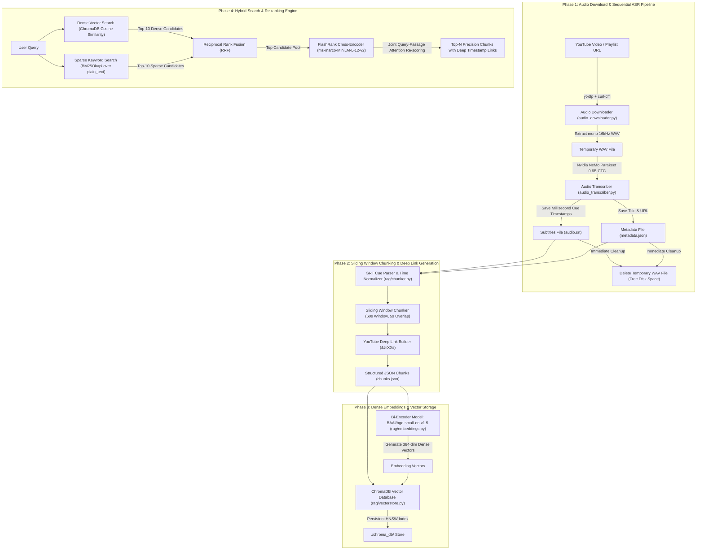

# Technical Architecture & System Design Specification: Video Knowledge RAG

This document provides a comprehensive, end-to-end technical deep dive into the **Video Knowledge RAG (Retrieval-Augmented Generation)** system. It covers the data ingestion pipeline, automatic speech recognition (ASR), sliding-window chunking algorithms, bi-encoder vector embeddings, persistent vector storage, hybrid search (BM25 + Dense Vectors), Reciprocal Rank Fusion (RRF), and FlashRank cross-encoder re-ranking. 

This guide is designed both as system documentation and as complete **technical interview preparation** for this project.

---

## 1. High-Level System Architecture & Flowchart

The system ingests YouTube videos, extracts high-fidelity audio, transcribes speech with word/cue timestamps, breaks down transcripts into time-aligned overlapping chunks, computes dense bi-encoder embeddings, indexes data in ChromaDB & BM25, and retrieves precise timestamp-linked context using cross-encoder re-ranking.



---

## 2. Step-by-Step Module Technical Breakdown

### Module 1: Sequential Audio Downloader & Disk Safety
- **Files:** [`audio_downloader.py`](file:///c:/Users/User/OneDrive/Documents/GitHub/Youtube-Rag/audio_downloader.py), [`main.py`](file:///c:/Users/User/OneDrive/Documents/GitHub/Youtube-Rag/main.py)
- **Role:** Handles resilient downloading of YouTube single videos or entire playlists without filling local storage.
- **Key Technical Details:**
  - **Tooling:** Uses `yt-dlp` combined with `curl-cffi` to bypass anti-bot and rate-limiting measures on YouTube.
  - **Callback Execution Pattern (`process_track_synchronously`):** Standard downloads pull all WAV files at once, requiring tens of gigabytes of disk space. Here, `yt-dlp` delegates a completion callback per track:
    1. Downloads single video audio as WAV (`16kHz`, mono).
    2. Immediately triggers ASR transcription.
    3. Deletes the multi-hundred-megabyte WAV file from disk **before** downloading the next track.

---

### Module 2: Automatic Speech Recognition (ASR)
- **File:** [`audio_transcriber.py`](file:///c:/Users/User/OneDrive/Documents/GitHub/Youtube-Rag/audio_transcriber.py)
- **Role:** Converts raw audio signals into timestamped subtitle tracks (`audio.srt`).
- **Key Technical Details:**
  - **Model:** Nvidia NeMo Parakeet CTC 0.6B (`nvidia/parakeet-ctc-0.6b`), a 600M parameter FastConformer model optimized for fast, accurate English ASR.
  - **Chunked Inference:** Large audio files are processed in 60-second audio segments with 1-second overlaps using `soundfile` and `torch`.
  - **SRT Cue Formatting:** Converts raw model character/word output into standard SRT subtitle blocks:
    ```srt
    1
    00:00:00,080 --> 00:00:10,720
    Today we're going to take a look at Needle 2, a tiny agentic LLM with only 45 million parameters...
    ```

---

### Module 3: Sliding Window Chunking & Deep Link Generation
- **Files:** [`rag/chunker.py`](file:///c:/Users/User/OneDrive/Documents/GitHub/Youtube-Rag/rag/chunker.py), [`rag/ingest.py`](file:///c:/Users/User/OneDrive/Documents/GitHub/Youtube-Rag/rag/ingest.py)
- **Role:** Parses subtitle timestamps, creates semantically rich time-overlapping windows, and computes YouTube deep-link URLs.
- **Key Technical Details:**
  - **Timestamp Normalization:** Converts SRT string format `HH:MM:SS,mmm` into float seconds ($t_{sec} = 3600 \times H + 60 \times M + S + \frac{ms}{1000}$).
  - **Sliding Time Window Algorithm:**
    - Window Size ($W$): `60.0` seconds
    - Overlap Size ($O$): `5.0` seconds
    - Step Size ($S = W - O$): `55.0` seconds
    - Aggregates all SRT subtitle cues whose time spans overlap with $[win\_start, win\_start + W]$.
  - **Dual Text Representation:**
    - `text`: Subtitle cues formatted with explicit inline timestamp brackets, e.g. `"[00:12:50] Set volume to 50."`
    - `plain_text`: Clean concatenated transcript text without brackets for clean embedding and BM25 tokenization.
  - **Deep-Link URL Calculation:**
    - Extract 11-character YouTube video ID (e.g. `0hgzLDHplYk`).
    - Generate millisecond/second start timestamp URL: `https://www.youtube.com/watch?v=0hgzLDHplYk&t=770s`
  - **Chunk Output Data Schema:**
    ```json
    {
      "chunk_id": "0hgzLDHplYk_14",
      "video_title": "Needle 2: The 45M Parameter Model That Runs Everywhere",
      "video_url": "https://www.youtube.com/watch?v=0hgzLDHplYk",
      "start_seconds": 770.0,
      "end_seconds": 831.0,
      "start_timestamp": "00:12:50",
      "end_timestamp": "00:13:51",
      "timestamp_url": "https://www.youtube.com/watch?v=0hgzLDHplYk&t=770s",
      "text": "[00:12:50] Set volume to 50. [00:12:55] Okay so it generated set volume volume 50...",
      "plain_text": "Set volume to 50. Okay so it generated set volume volume 50...",
      "cues": [...]
    }
    ```

---

### Module 4: Bi-Encoder Embeddings & Persistent Vector Database
- **Files:** [`rag/config.py`](file:///c:/Users/User/OneDrive/Documents/GitHub/Youtube-Rag/rag/config.py), [`rag/embeddings.py`](file:///c:/Users/User/OneDrive/Documents/GitHub/Youtube-Rag/rag/embeddings.py), [`rag/vectorstore.py`](file:///c:/Users/User/OneDrive/Documents/GitHub/Youtube-Rag/rag/vectorstore.py)
- **Role:** Generates dense semantic vector representations and persists vectors & metadata locally.
- **Key Technical Details:**
  - **Embedding Model (`BAAI/bge-small-en-v1.5`):**
    - Architecture: Bi-Encoder transformer (384 dimensions, ~133MB footprint).
    - Top benchmark score on Massive Text Embedding Benchmark (MTEB) for compact models.
    - Fast batch inference on both CPU and CUDA GPU.
  - **Vector Database (ChromaDB):**
    - Local persistent HNSW (Hierarchical Navigable Small World) index saved in `./chroma_db/`.
    - Distance Metric: Cosine Distance ($D_{cosine} = 1 - \frac{u \cdot v}{\|u\| \|v\|}$).
    - Rich Metadata Storage: Stores all video metadata, timestamps, deep links, and serialized cue JSON (`cues_json`) directly inside vector payload records.

---

### Module 5: Hybrid Search (BM25 + Dense Vectors) & FlashRank Re-ranking Engine
- **File:** [`rag/retriever.py`](file:///c:/Users/User/OneDrive/Documents/GitHub/Youtube-Rag/rag/retriever.py)
- **Role:** Delivers high precision retrieval by combining dense semantic search, sparse keyword search, rank fusion, and cross-encoder re-ranking.
- **Key Technical Details:**

#### 1. Dense Vector Search
Retrieves candidates based on vector dot-product / cosine similarity over `bge-small-en-v1.5` embeddings. Catches semantic intent (e.g. `"adjust audio output"` matches `"set volume to 50"`).

#### 2. Sparse BM25 Keyword Search
Uses `BM25Okapi` (`rank_bm25`) over tokenized `plain_text`. Catches exact model parameters, function names, commands, numbers, and flags (e.g. `"45M"`, `"Termux"`, `"volume 50"`).

#### 3. Reciprocal Rank Fusion (RRF)
Combines dense vector rank positions and sparse BM25 rank positions into a unified score for candidate selection:
$$\text{RRF\_Score}(d) = \sum_{m \in \{\text{dense}, \text{sparse}\}} \frac{1}{k + r_m(d)}$$
where $k = 60$ (smoothing constant) and $r_m(d)$ is the 1-based rank index of document $d$ in system $m$.

#### 4. FlashRank Cross-Encoder Re-ranking
- Model: `ms-marco-MiniLM-L-12-v2` via `flashrank`.
- Unlike Bi-Encoders which compute query and document representations independently, a **Cross-Encoder** feeds the query and candidate passage simultaneously into self-attention layers:
$$\text{Score} = \text{Transformer}(\text{Query} \oplus \text{Passage})$$
- Evaluates fine-grained token-level cross-attention interactions, boosting top precision candidates to scores like **0.998+**.

---

## 3. Step-by-Step End-to-End Data Pipeline Flow

```
┌──────────────────────────────────────────────────────────────────────────────────┐
│ STEP 1: INPUT                                                                    │
│ User passes YouTube Video URL: "https://www.youtube.com/watch?v=0hgzLDHplYk"     │
└─────────────────────────┬────────────────────────────────────────────────────────┘
                          │
                          ▼
┌──────────────────────────────────────────────────────────────────────────────────┐
│ STEP 2: DOWNLOAD & ASR                                                           │
│ 1. audio_downloader.py extracts audio as 16kHz mono WAV                         │
│ 2. audio_transcriber.py runs Nvidia NeMo Parakeet 0.6B CTC                       │
│ 3. Generates op/<Title>/audio.srt & metadata.json                                │
│ 4. Deletes temp WAV file to preserve C: drive space                              │
└─────────────────────────┬────────────────────────────────────────────────────────┘
                          │
                          ▼
┌──────────────────────────────────────────────────────────────────────────────────┐
│ STEP 3: SLIDING WINDOW CHUNKING                                                  │
│ 1. rag/chunker.py parses SRT time cues                                           │
│ 2. Groups into 60s windows with 5s overlap                                       │
│ 3. Generates timestamp URLs (e.g. &t=770s) & saves to op/<Title>/chunks.json     │
└─────────────────────────┬────────────────────────────────────────────────────────┘
                          │
                          ▼
┌──────────────────────────────────────────────────────────────────────────────────┐
│ STEP 4: VECTOR & SPARSE INDEXING                                                 │
│ 1. BAAI/bge-small-en-v1.5 generates 384-dim embeddings for plain_text            │
│ 2. VectorStoreManager upserts vectors + rich metadata into local ./chroma_db/    │
│ 3. HybridRetriever builds BM25 sparse index over plain_text tokens               │
└─────────────────────────┬────────────────────────────────────────────────────────┘
                          │
                          ▼
┌──────────────────────────────────────────────────────────────────────────────────┐
│ STEP 5: HYBRID RETRIEVAL & FLASHRANK RERANKING                                   │
│ User Query: "how to set the volume to 50 on Android"                             │
│ 1. Dense Search -> Returns Top-10 vectors                                        │
│ 2. BM25 Search  -> Returns Top-10 keyword matches                                │
│ 3. RRF Fusion   -> Fuses rank positions with smoothing constant k=60             │
│ 4. FlashRank    -> Passes top passages through ms-marco-MiniLM-L-12-v2           │
│ Result          -> Match #1: 0hgzLDHplYk_14 (00:12:50 -> 00:13:51) [Score: 0.9984] │
│                    Deep Link: https://www.youtube.com/watch?v=0hgzLDHplYk&t=770s │
└──────────────────────────────────────────────────────────────────────────────────┘
```

---

## 4. Key Interview Questions & Technical Answers (FAQ)

### Q1: Why did you choose a 60-second time sliding window with 5-second overlap instead of token/character chunking?
**Answer:**
Video transcripts differ fundamentally from text documents. Speech flows continuously over time, and ideas/explanations span across multiple sentences. Token or character splitting can chop a sentence mid-phrase or lose temporal alignment. A time-based 60-second window preserves natural speech context while keeping the exact timestamp interval manageable. The 5-second overlap ensures that sentences spanning across window boundaries are not lost or split across chunks.

### Q2: Why use Hybrid Search (BM25 + Dense Vectors) instead of Vector Search alone?
**Answer:**
Dense semantic embeddings (like `bge-small-en-v1.5`) excel at understanding intent and paraphrased queries (e.g. matching `"adjust sound"` to `"set volume"`). However, dense vectors struggle with exact keyword matching, numbers, technical flags, model parameter sizes, or shell command names (e.g. `"45M"`, `"Termux"`, `"volume 50"`). BM25 sparse retrieval ensures exact keyword matches are never missed, while dense search ensures semantic meaning is captured. Combining both via Reciprocal Rank Fusion (RRF) gives the best of both worlds.

### Q3: What is Reciprocal Rank Fusion (RRF) and why is it preferred over raw score addition?
**Answer:**
Vector search returns cosine distances (between 0.0 and 1.0), while BM25 returns un-bounded score totals based on term frequency and inverse document frequency. Adding or weighting these raw scores directly requires fragile normalization. RRF works strictly on **rank positions**:
$$RRF\_Score(d) = \frac{1}{60 + r_{dense}} + \frac{1}{60 + r_{sparse}}$$
Because it relies on rank order rather than raw scores, it cleanly merges scores from completely different retrieval paradigms.

### Q4: What is the difference between a Bi-Encoder and a Cross-Encoder, and why use both?
**Answer:**
- **Bi-Encoder (`bge-small-en-v1.5`):** Encodes the Query and the Document independently into vector space. Vectors can be pre-computed and stored in a vector DB for fast similarity search across millions of documents in milliseconds.
- **Cross-Encoder (`ms-marco-MiniLM-L-12-v2` / FlashRank):** Takes the Query and Document *together* as a single input pair into transformer self-attention layers, allowing full cross-attention between query words and document words. Cross-encoders are much more accurate but too slow to run across an entire database.
- **Two-Stage Architecture:** We use the Bi-Encoder + BM25 to rapidly narrow down millions/thousands of chunks to 10 candidates, and then use the Cross-Encoder (FlashRank) to re-rank those 10 candidates for top precision.

### Q5: How does the system prevent running out of disk space during large playlist ingestion?
**Answer:**
Raw uncompressed 16kHz WAV audio files consume ~2MB per minute. Ingesting dozens of long videos could easily fill tens of gigabytes of disk space. In `main.py`, we implement a synchronous callback pattern (`process_track_synchronously`). As soon as `yt-dlp` finishes downloading one audio track, the callback immediately runs ASR transcription, generates `audio.srt`, and **deletes the WAV file from disk** before `yt-dlp` starts downloading the next track.

---

## 5. System File Reference Map

| Module / File | Description |
| :--- | :--- |
| [`main.py`](file:///c:/Users/User/OneDrive/Documents/GitHub/Youtube-Rag/main.py) | Entry point executing sequential download, transcription, and cleanup pipeline |
| [`audio_downloader.py`](file:///c:/Users/User/OneDrive/Documents/GitHub/Youtube-Rag/audio_downloader.py) | `yt-dlp` audio extractor with browser cookies & callback support |
| [`audio_transcriber.py`](file:///c:/Users/User/OneDrive/Documents/GitHub/Youtube-Rag/audio_transcriber.py) | Local ASR transcriber using Nvidia NeMo Parakeet CTC 0.6B |
| [`rag/chunker.py`](file:///c:/Users/User/OneDrive/Documents/GitHub/Youtube-Rag/rag/chunker.py) | SRT timestamp parser, 60s/5s sliding window chunker, deep link generator |
| [`rag/config.py`](file:///c:/Users/User/OneDrive/Documents/GitHub/Youtube-Rag/rag/config.py) | Model names (`bge-small-en-v1.5`, `ms-marco-MiniLM-L-12-v2`) & ChromaDB paths |
| [`rag/embeddings.py`](file:///c:/Users/User/OneDrive/Documents/GitHub/Youtube-Rag/rag/embeddings.py) | Bi-Encoder embedding wrapper for dense vector generation |
| [`rag/vectorstore.py`](file:///c:/Users/User/OneDrive/Documents/GitHub/Youtube-Rag/rag/vectorstore.py) | Persistent ChromaDB manager with vector upsert & similarity querying |
| [`rag/retriever.py`](file:///c:/Users/User/OneDrive/Documents/GitHub/Youtube-Rag/rag/retriever.py) | Hybrid Search engine (ChromaDB + BM25 + RRF + FlashRank re-ranking) |
| [`rag/ingest.py`](file:///c:/Users/User/OneDrive/Documents/GitHub/Youtube-Rag/rag/ingest.py) | Automated video ingestion hook connecting SRT chunking to ChromaDB |
