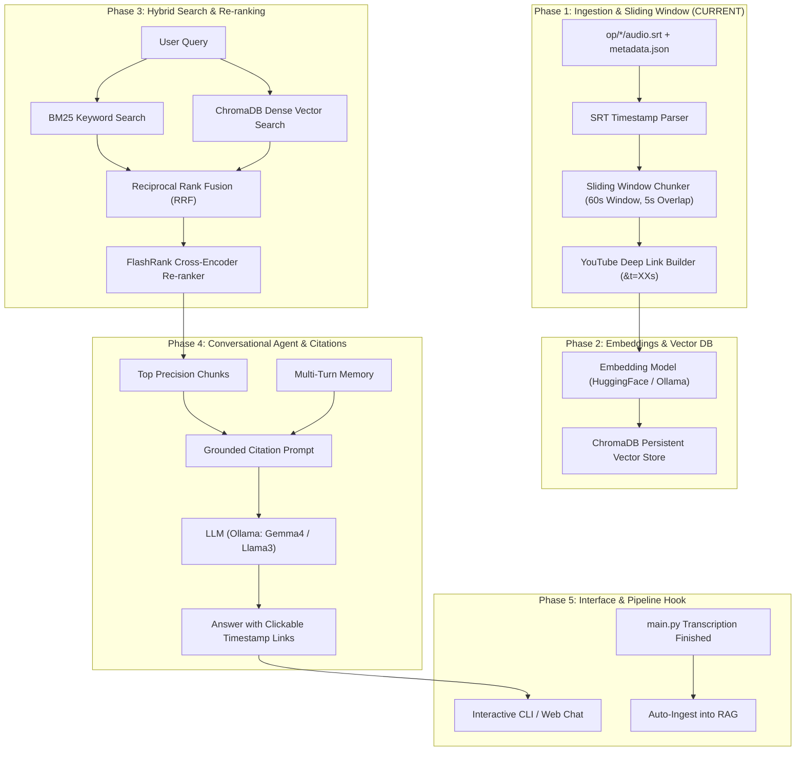

# Video Knowledge RAG: Step-by-Step Development Roadmap

This document defines the exact module-by-module execution order for building the production-grade Video Knowledge RAG conversational agent.

---

## Architecture & Data Flow



---

## Step-by-Step Development Order

```
┌─────────────────────────────────────────────────────────────┐
│ STEP 1: Data Ingestion & 60s/5s Sliding Window Chunker     │  ◄── START HERE
├─────────────────────────────────────────────────────────────┤
│ STEP 2: Embeddings & ChromaDB Vector Store                  │
├─────────────────────────────────────────────────────────────┤
│ STEP 3: Hybrid Retrieval (BM25 + Dense) & FlashRank Reranker│
├─────────────────────────────────────────────────────────────┤
│ STEP 4: Conversational RAG Agent with Citation Engine       │
├─────────────────────────────────────────────────────────────┤
│ STEP 5: Interactive Chat UI / CLI                           │
├─────────────────────────────────────────────────────────────┤
│ STEP 6: Auto-Ingestion Hook into main.py                    │
└─────────────────────────────────────────────────────────────┘
```

---

### Phase 1: Data Ingestion & Sliding Window Chunker (Build First)
**Files:** `rag/chunker.py`, `rag/ingest.py`
- **Why First:** Everything in RAG depends on the quality, format, and metadata of your chunks.
- **Tasks:**
  1. **SRT Cue Parser:** Convert timestamp strings (`00:01:23,450`) into exact float seconds (`83.45`).
  2. **Sliding Window Chunking:**
     - `chunk_window = 60.0` seconds
     - `overlap_window = 5.0` seconds (effective step = `55.0` seconds)
     - Group all SRT subtitle cues falling within `[start_time, start_time + 60s]`.
  3. **Deep-Link Generator:** Construct clickable YouTube URLs with seconds query:
     - Format: `https://www.youtube.com/watch?v={video_id}&t={int(start_seconds)}s`
  4. **Output Schema:** Standardized Python dictionary / Pydantic model:
     ```python
     {
         "chunk_id": "DZIymFrEXik_0",
         "video_title": "Do THIS instead of watching endless tutorials...",
         "video_url": "https://www.youtube.com/watch?v=DZIymFrEXik",
         "start_seconds": 0.0,
         "end_seconds": 60.0,
         "start_timestamp": "00:00:00",
         "end_timestamp": "00:01:00",
         "timestamp_url": "https://www.youtube.com/watch?v=DZIymFrEXik&t=0s",
         "text": "If you've ever tried to learn Python..."
     }
     ```
- **Deliverable / Verification:** Run a test script on `op/Do THIS instead of watching endless tutorials.../audio.srt` and verify chunks, timestamps, and URLs print correctly.

---

### Phase 2: Embedding Generation & ChromaDB Vector Store
**Files:** `rag/config.py`, `rag/embeddings.py`, `rag/vectorstore.py`
- **Tasks:**
  1. Set up an embedding model (e.g. `sentence-transformers/all-MiniLM-L6-v2` or `nomic-embed-text` via Ollama).
  2. Initialize local persistent `ChromaDB` inside `./chroma_db/`.
  3. Index the chunks from Phase 1 into Chroma with rich metadata (`video_title`, `timestamp_url`, `start_timestamp`, `start_seconds`).
- **Deliverable / Verification:** Query ChromaDB for `"tutorial hell"` and confirm it returns the chunk spanning `00:00:00 --> 00:01:00`.

---

### Phase 3: Hybrid Retrieval & Re-ranking Layer
**Files:** `rag/retriever.py`
- **Tasks:**
  1. **Sparse Index (BM25):** Index chunk texts with `rank_bm25` for exact keyword matches (names, libraries, errors).
  2. **Hybrid Combiner (RRF):** Combine scores from ChromaDB vector search and BM25 search.
  3. **Cross-Encoder Re-ranker:** Pass candidate chunks through `FlashRank` to rank the top 3–5 most relevant chunks.
- **Deliverable / Verification:** Test queries like `"what salary can an AI engineer get?"` to verify the exact chunk mentioning \$175k-\$300k is ranked #1.

---

### Phase 4: Conversational Agent & Citation Prompt
**Files:** `rag/agent.py`
- **Tasks:**
  1. Connect Ollama LLM (`gemma4:31b` or your chosen model) using LangChain.
  2. Implement multi-turn conversation memory (`ChatMessageHistory`).
  3. **Strict Citation Prompting:** Instruct the model to cite the exact video and timestamp link whenever making a statement:
     - Example: `According to [Do THIS instead... @ 00:47](https://www.youtube.com/watch?v=...&t=47s), AI engineers earn between $175k and $200k.`
- **Deliverable / Verification:** Ask complex questions and verify the response includes valid, clickable timestamp deep links.

---

### Phase 5: Interactive User Interface (CLI & Web)
**Files:** `rag/chat.py` (and optionally `app.py`)
- **Tasks:**
  1. Create a rich interactive terminal chat loop where users can ask questions and get instant markdown-rendered links.
  2. (Optional) Simple Streamlit or lightweight web UI with an embedded YouTube player that jumps to the timestamp when clicked.

---

### Phase 6: Automatic Ingestion Hook in `main.py`
**Files:** `main.py`
- **Tasks:**
  1. Add a call to `ingest_video(video_folder)` directly in `process_track_synchronously()` right after `audio.srt` is written.
  2. Any newly downloaded video is instantly transcribed and added to the RAG knowledge base automatically.
