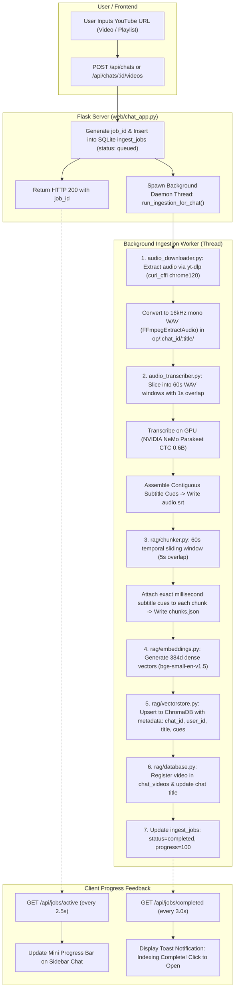
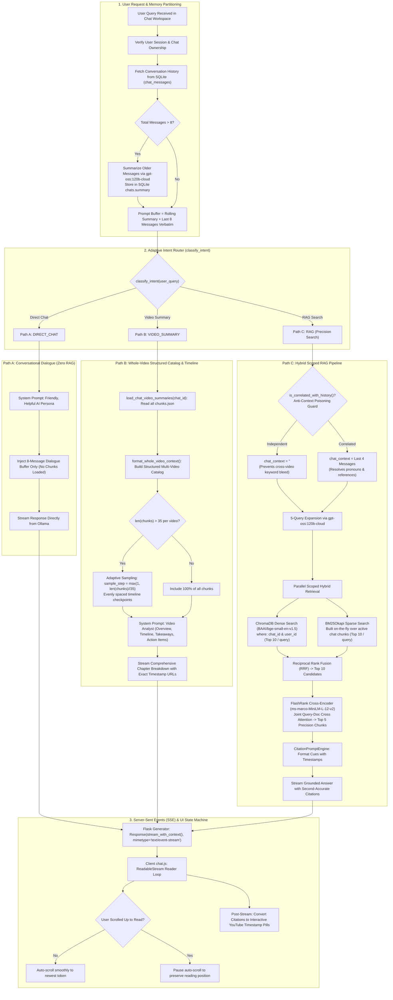

# Video Knowledge RAG: Comprehensive Technical Specification & Function-Level Architecture

This document provides an exhaustive, function-by-function, class-by-class, and component-by-component technical breakdown of the entire **Video Knowledge RAG** platform. It details all technologies, frameworks, algorithms, schemas, custom setups, mathematical formulations, and multi-path input-to-output flow pipelines.

---

## 1. Technology Stack & Framework Matrix

| Component Layer | Technology / Framework | Specific Model / Library | Primary Role & Rationale |
| :--- | :--- | :--- | :--- |
| **Audio Extraction** | `yt-dlp` + `curl-cffi` | Standalone Python Wrapper | High-speed, resilient YouTube audio stream extraction with browser fingerprint impersonation (`chrome120`) to prevent bot blocks. Converts audio to mono 16kHz WAV. |
| **Speech-to-Text (ASR)** | NVIDIA NeMo Toolkit | `nvidia/parakeet-ctc-0.6b` (FastConformer) | Local GPU-accelerated automatic speech recognition. Generates word- and segment-level timestamps in SRT format with near-human transcription accuracy. |
| **Text Chunking** | Custom Sliding Window | Python Standard Library | 60-second temporal sliding window with 5-second overlap. Retains individual subtitle cues (millisecond precision) inside each chunk for exact second citation. |
| **Dense Embeddings** | SentenceTransformers | `BAAI/bge-small-en-v1.5` | Generates 384-dimensional dense semantic vectors. Outstanding retrieval accuracy on HuggingFace MTEB with negligible inference latency. |
| **Vector Database** | ChromaDB | `chromadb.PersistentClient` | Embedded vector store. Employs HNSW index with Cosine similarity (`hnsw:space: cosine`) and multi-tenant metadata filtering (`where={"chat_id": chat_id, "user_id": user_id}`). |
| **Sparse Keyword Search** | Rank-BM25 | `BM25Okapi` | Fast lexical/keyword ranking. Built on-the-fly over the active chat's scoped corpus to capture technical jargon, function names, and proper nouns. |
| **Re-ranking Engine** | FlashRank | `ms-marco-MiniLM-L-12-v2` | Ultra-fast cross-encoder. Jointly scores candidate chunks against user query, eliminating false positives from bi-encoder retrieval. |
| **LLM Reasoning & Generation** | Ollama API Client | `gpt-oss:120b-cloud` | 120B open-weight LLM running via local Ollama server (`localhost:11434`). Performs 5-query expansion, recursive rolling summarization, intent classification, and grounded answer synthesis. |
| **Relational Storage** | SQLite 3 | WAL Mode (`rag_app.db`) | Stores users, OTP codes, sessions, chats, message histories, indexed video metadata, and active background ingestion jobs. |
| **Web Application Server** | Flask & Werkzeug | Flask 3.x + `threaded=True` | Production WSGI HTTP server running on Port 5000. Coordinates async background ingestion workers, REST APIs, and Server-Sent Events (SSE) streaming. |
| **Email Messaging (OTP)** | Python Standard Library | `smtplib` + `email.mime` | Dispatches 6-digit cryptographic OTP codes via standard SMTP with STARTTLS (587) or SSL (465), with dynamic `.env` configuration and dev console fallback. |
| **Real-Time Streaming** | Server-Sent Events (SSE) | W3C EventSource / Fetch Streams | Delivers token-by-token LLM streaming directly to the client browser with zero latency and smooth UI auto-scroll handling. |
| **Frontend UI/UX** | Vanilla HTML5 / CSS3 / ES6+ | Inter, Outfit, JetBrains Mono | Custom-engineered glassmorphic dark theme, responsive collapsible sidebar, real-time background progress bars, and interactive YouTube timestamp pills. Zero client-side bloat. |

---

## 2. Directory & Module Topology

```
Rag/
├── main.py                     # Unified entrypoint; launches WSGI server on Port 5000
├── audio_downloader.py         # YouTube video and playlist audio extraction via yt-dlp
├── audio_transcriber.py        # NVIDIA NeMo Parakeet CTC 0.6B GPU transcription
├── requirements.txt            # Python environment dependencies
├── README.md                   # User guide & architectural overview
├── technical_details.md        # Function-level technical specification (this document)
├── .env                        # Live environment variables (SMTP credentials, etc.)
├── rag_app.db                  # Persistent SQLite database (WAL mode)
├── chroma_db/                  # Persistent ChromaDB vector index directory
├── op/                         # Video output root, partitioned by chat_id
│   └── <chat_id>/<video_title>/
│       ├── audio.srt           # Full subtitle cues with millisecond timestamps
│       ├── metadata.json       # Video title, URL, duration, channel
│       └── chunks.json         # 60s sliding window chunks with cue arrays
├── rag/
│   ├── __init__.py
│   ├── config.py               # Central configuration constants & dynamic .env loader
│   ├── database.py             # SQLite ORM layer with foreign key cascades
│   ├── auth.py                 # OTP generation, SMTP dispatch, session management
│   ├── chunker.py              # Temporal sliding-window chunker with subtitle cue parsing
│   ├── embeddings.py           # BAAI/bge-small-en-v1.5 bi-encoder embedding manager
│   ├── vectorstore.py          # ChromaDB collection manager with chat_id metadata scoping
│   ├── retriever.py            # Parallel hybrid search (BM25 + Dense) + RRF + FlashRank
│   ├── ingest.py               # Video ingestion pipeline tagging chunks with chat & user ID
│   ├── agent.py                # gpt-oss:120b-cloud RAG agent, streaming, intent router, memory
│   └── chat.py                 # Interactive CLI chat utility
└── web/
    ├── chat_app.py             # Flask application service with SSE streaming endpoints
    ├── templates/
    │   └── chat.html           # Unified web application interface with OTP modal
    └── static/
        ├── css/
        │   └── chat.css        # Responsive glassmorphic dark design system
        └── js/
            └── chat.js         # Client state, auth handler, SSE stream reader, citations
```

---

## 3. End-to-End System Flow Diagrams

### Diagram 1: Background Video Ingestion Pipeline



---

### Diagram 2: Adaptive 3-Path Conversational & RAG Routing Decision Tree



---

## 4. Function-by-Function Reference

### Module: `audio_downloader.py`
Provides resilient audio stream downloading for single YouTube videos and playlists.

#### `download_audio(url: str, output_dir: str, on_complete_callback: Optional[Callable] = None, on_progress_callback: Optional[Callable] = None) -> List[Dict[str, Any]]`
- **Parameters**:
  - `url` (`str`): Target YouTube video or playlist URL.
  - `output_dir` (`str`): Destination directory (`op/<chat_id>`).
  - `on_complete_callback` (`Optional[Callable]`): Triggered as each track finishes: `on_complete_callback(idx, total, track_dict)`.
  - `on_progress_callback` (`Optional[Callable]`): Real-time download percentage callback.
- **Implementation**:
  - Configures `yt-dlp` with `curl_cffi` browser impersonation (`chrome120`) to bypass anti-bot challenges.
  - Slices audio and converts to mono 16kHz 16-bit PCM WAV using `FFmpegExtractAudio`.
  - Disables `noplaylist` (`noplaylist: False`) to seamlessly parse full playlists.
  - Writes `metadata.json` (`title`, `url`, `duration`, `uploader`) into a sanitized video folder.
- **Returns**: A list of dictionaries containing `title`, `url`, `video_folder`, and `audio_path`.

---

### Module: `audio_transcriber.py`
GPU-accelerated speech-to-text transcription powered by NVIDIA NeMo FastConformer.

#### `load_model() -> EncDecCTCModelBPE`
- Loads `nvidia/parakeet-ctc-0.6b` FastConformer-CTC onto `cuda:0`.
- Configures decoding strategy to preserve word- and character-level timestamp emissions.
- Clears CUDA cache before model initialization.

#### `transcribe_audio(audio_file: str, chunk_seconds: float = 60.0, overlap_seconds: float = 1.0) -> List[Dict[str, Any]]`
- **Sliding-Window GPU Audio Slicing**: Slices long audio into 60s WAV segments with 1s overlap to eliminate GPU VRAM out-of-memory errors on 1–2 hour lectures.
- Offsets timestamps relative to the segment window start time.
- Emits formatted subtitle cues (`start_sec`, `end_sec`, `start_timestamp`, `end_timestamp`, `text`).
- Writes standard `audio.srt` in the video directory.

---

### Module: `rag/chunker.py`
Temporal sliding-window chunker with subtitle cue preservation.

#### `parse_srt_to_cues(srt_path: str) -> List[Dict[str, Any]]`
- Parses standard SubRip (`.srt`) files into individual structured cue objects with start/end millisecond timestamps.

#### `chunk_transcript(cues: List[Dict[str, Any]], window_seconds: float = 60.0, overlap_seconds: float = 5.0, video_title: str = "", video_url: str = "") -> List[Dict[str, Any]]`
- Groups cues into 60-second temporal windows with a 5-second sliding overlap.
- Retains the underlying array of granular sentence cues inside each chunk's `cues` field.
- Attaches exact YouTube deep links (`&t=XXs`) computed from the starting second of the chunk.

---

### Module: `rag/embeddings.py`
Dense vector embedding management using `BAAI/bge-small-en-v1.5`.

#### `embed_text(text: str) -> List[float]`
- Generates a 384-dimensional normalized dense embedding vector for a single query or text segment.

#### `embed_batch(texts: List[str]) -> List[List[float]]`
- Generates 384-dimensional dense vectors in optimized batches with normalized L2 embeddings for cosine similarity.

---

### Module: `rag/vectorstore.py`
ChromaDB persistent collection manager with multi-tenant metadata isolation.

#### `upsert_chunks(chunks: List[Dict[str, Any]], chat_id: Optional[str] = None, user_id: Optional[str] = None) -> int`
- Serializes chunk cues into JSON strings (`cues_json`) to conform to ChromaDB's scalar metadata constraint.
- Prefixes chunk IDs with `cid_{chat_id}_` to guarantee cross-chat collision safety.
- Stores vector documents and metadata into the persistent `youtube_rag_chunks` collection.

#### `query_similar(query_text: str, top_k: int = 10, chat_id: Optional[str] = None, user_id: Optional[str] = None) -> List[Dict[str, Any]]`
- Executes cosine distance queries against ChromaDB.
- Applies strict boolean metadata filtering:
  ```python
  where = {"$and": [{"chat_id": str(chat_id)}, {"user_id": str(user_id)}]}
  ```
- Deserializes `cues_json` back into native Python dictionaries for downstream citation generation.

#### `get_all_chunks(chat_id: Optional[str] = None, user_id: Optional[str] = None) -> List[Dict[str, Any]]`
- Retrieves all indexed chunks, optionally scoped to a single chat and user.
- Used by `rag/retriever.py` to construct an on-the-fly BM25 index exclusively for the active chat.

#### `delete_by_chat_id(chat_id: str) -> int`
- Completely purges all vectors and metadata belonging to a specific `chat_id` when a chat is deleted.

---

### Module: `rag/retriever.py`
Parallel hybrid retrieval combining Dense ChromaDB search, chat-scoped BM25Okapi lexical matching, Reciprocal Rank Fusion (RRF), and FlashRank Cross-Encoder re-ranking.

#### `dense_search(query_text: str, top_k: int = 10, chat_id: Optional[str] = None, user_id: Optional[str] = None) -> List[Dict[str, Any]]`
- Queries ChromaDB with exact `chat_id` and `user_id` scoping.

#### `sparse_search(query_text: str, top_k: int = 10, chat_id: Optional[str] = None, user_id: Optional[str] = None) -> List[Dict[str, Any]]`
- Dynamically extracts all chunks belonging strictly to `chat_id` and `user_id`.
- Builds an in-memory `BM25Okapi` index on-the-fly over that chat's text corpus.
- Tokenizes query using `SimpleTokenizer` (alphanumeric lower-case tokenization) and returns top BM25 matches.

#### `reciprocal_rank_fusion(dense_results: List[List[Dict]], sparse_results: List[List[Dict]], top_candidates: int = 10, k: int = 60) -> List[Dict[str, Any]]`
- Merges multi-query dense and sparse retrieval ranks using the standard RRF algorithm:
  $$\text{RRF Score}(d) = \sum_{q \in Q} \sum_{m \in \{\text{dense}, \text{sparse}\}} \frac{1}{k + \text{rank}_{q,m}(d)}$$
  where $k = 60$. Deduplicates chunks across all 5 expanded queries and yields the Top 10 unified candidates.

#### `rerank(query_text: str, candidates: List[Dict[str, Any]], top_k: int = 5) -> List[Dict[str, Any]]`
- Feeds the Top 10 RRF candidates to `Ranker(model_name="ms-marco-MiniLM-L-12-v2")`.
- Performs joint cross-attention over `[Query, Candidate Document]`.
- Returns the definitive Top 5 highest-scoring precision chunks.

---

### Module: `rag/agent.py`
Core intelligence orchestrator: query expansion, anti-context poisoning, adaptive intent routing, structured catalog compilation, and Server-Sent Events (SSE) streaming.

#### `QueryTransformer.expand_query(user_query: str, chat_context: str = "") -> List[str]`
- Invokes `gpt-oss:120b-cloud` to produce 5 distinct search queries exploring synonyms, technical keywords, and sub-aspects.

#### `QueryTransformer.is_correlated_with_history(user_query: str, chat_context: str) -> bool`
- **Anti-Context Poisoning Guard**: Evaluates whether the current query depends on previous chat context (pronouns like "it", "they", "that tool", or follow-up questions like "can you explain more?").
- If the query is independent (e.g. user suddenly asks about a different video or topic), it returns `False`, causing the agent to set `chat_context = ""`. This prevents past conversation keywords from corrupting the retrieval of the new query.

#### `ConversationMemory.summarize_and_buffer(messages: List[Dict], existing_summary: str = "") -> Tuple[str, List[Dict]]`
- Partitions the SQLite conversation history into:
  1. `buffer`: The immediate last 8 messages (4 turns), preserved verbatim.
  2. `older_messages`: Messages beyond the 8-message buffer.
- If `older_messages` exist, invokes `gpt-oss:120b-cloud` to merge them into a recursive rolling summary stored in SQLite `chats.summary`.

#### `classify_intent(user_query: str) -> str`
- **Zero-Latency Regex Heuristics + LLM Fallback**:
  - Classifies query into:
    1. `"DIRECT_CHAT"`: Greetings, thanks, polite remarks, casual dialogue, and **chat workspace meta-questions** (e.g. *"how many videos are in this chat?"*, *"what videos are here?"*, *"list all videos"*). Answered directly with workspace metadata without triggering RAG.
    2. `"VIDEO_SUMMARY"`: Explicit requests to summarize whole videos, generate outlines, chapters, or takeaways.
    3. `"RAG"`: Questions about facts, concepts, tools, code, or details in the videos.

#### `format_chat_video_library_header(chat_id: str) -> str`
- Queries SQLite `chat_videos` and formats a clean, human-readable catalog of all videos registered in the active chat workspace (including titles, YouTube URLs, and segment counts).
- Injected into **`DIRECT_CHAT`** prompts and **`RAG`** system prompts (`CitationPromptEngine.build_system_prompt()`), ensuring the LLM is always aware of the active chat's video library and can accurately answer questions about the videos without guessing.

#### `load_chat_video_summaries(chat_id: str) -> List[Dict[str, Any]]`
- Reads SQLite `chat_videos` for the active chat.
- Resolves `chunks.json` for every video belonging to that chat:
  - Supports direct video paths: `op/<chat_id>/<folder_name>/chunks.json`
  - **Recursive Playlist Folder Walk**: Automatically walks subdirectories to locate nested playlist video folders (e.g. `op/<chat_id>/<playlist_title>/<video_title>/chunks.json`), guaranteeing that all video chunks in a playlist load reliably for whole-video summarization.
- Returns a list containing video titles, URLs, and 100% of all chunks.

#### `format_whole_video_context(video_data: List[Dict[str, Any]]) -> str`
- Builds the ephemeral, in-memory **Structured Catalog** across all videos in the chat:
  ```text
  === VIDEO 1: Title (URL) ===
  Full Duration: 00:00:00 to 00:15:30 (28 total segments)
  Chronological Transcript Segments:
    [00:00:00 - 00:01:10] (timestamp_url) Transcript text...
  ```
- **Adaptive Downsampling**: If `len(chunks) > 35`, computes:
  $$\text{sample\_step} = \max(1, \lfloor \text{len(chunks)} / 35 \rfloor)$$
  Evenly downsamples chunks across the video timeline, guaranteeing that prompts never overflow the LLM context window even with 10+ long videos in a single chat.

#### `VideoRAGAgent.chat_scoped_stream(user_query: str, chat_id: str, user_id: str) -> Generator[Dict[str, Any], None, None]`
- Real-time token streaming generator for Flask SSE:
  1. Yields `{"event": "status", "message": "Analyzing query & conversational intent..."}`
  2. Partitions message history into 8-message buffer and rolling summary.
  3. Classifies intent via `classify_intent()`.
  4. Routes into **Path A** (`DIRECT_CHAT`), **Path B** (`VIDEO_SUMMARY`), or **Path C** (`RAG`).
  5. For Path C: checks correlation with history $\to$ expands 5 queries $\to$ performs hybrid search $\to$ RRF $\to$ FlashRank.
  6. Yields `{"event": "token", "delta": token}` continuously as `gpt-oss:120b-cloud` streams output.
  7. Converts citations using `CitationPromptEngine.linkify_citations()`.
  8. Saves the final assistant response to SQLite `chat_messages`.
  9. Yields `{"event": "done", "answer": ..., "chunks": ..., "expanded_queries": ...}`.

---

### Module: `rag/database.py`
SQLite ORM layer enforcing WAL mode, foreign key cascades, and connection pooling.

#### Core Tables & Methods:
- `users`: `id`, `email`, `created_at`
- `otp_codes`: `id`, `email`, `code`, `expires_at`, `verified`
- `sessions`: `token`, `user_id`, `created_at`, `expires_at`
- `chats`: `chat_id`, `user_id`, `title`, `summary`, `created_at`, `updated_at`
- `chat_messages`: `id`, `chat_id`, `user_id`, `role`, `content`, `metadata_json`, `created_at`
- `chat_videos`: `id`, `chat_id`, `user_id`, `video_title`, `video_url`, `folder_name`, `chunk_count`, `cues_count`, `status`, `created_at`
- `ingest_jobs`: `job_id`, `chat_id`, `user_id`, `url`, `status`, `step`, `progress`, `logs_json`, `created_at`, `completed_at`
- `get_active_jobs_for_chat(chat_id)`: Fetches in-flight (`queued`, `processing`) ingestion jobs strictly for a specific chat workspace to prevent duplicate queue submissions.

---

### Module: `web/chat_app.py`
Production Flask application on Port 5000 coordinating REST APIs, background workers, duplicate prevention, and Server-Sent Events.

#### `extract_youtube_identifiers(url: str) -> Dict[str, Optional[str]]`
- Robust parser extracting `video_id` and `playlist_id` across all YouTube URL variations:
  - Standard watch: `youtube.com/watch?v=VIDEO_ID`
  - Shortened links: `youtu.be/VIDEO_ID`
  - Embed links: `youtube.com/embed/VIDEO_ID`
  - YouTube Shorts: `youtube.com/shorts/VIDEO_ID`
  - Playlists: `youtube.com/playlist?list=PLAYLIST_ID`
  - Combined watch + playlist: `youtube.com/watch?v=VIDEO_ID&list=PLAYLIST_ID`

#### `check_duplicate_video_in_chat(chat_id: str, new_url: str) -> tuple[bool, str]`
- Validates whether an incoming video or playlist is already indexed or actively processing in that chat workspace:
  1. Checks `video_id` and `playlist_id` against all records in SQLite `chat_videos`.
  2. Inspects `metadata.json` on disk to detect if an individual video being added was already ingested as part of a previously added playlist.
  3. Checks `get_active_jobs_for_chat(chat_id)` to prevent queueing an identical URL while ingestion is in-flight.
- Returns `(True, "This video ('...') is already added in this chat.")` or `(True, "This playlist is already added in this chat.")` to block duplicates with HTTP 400.

#### Key Endpoints:
- `POST /api/chats/<chat_id>/videos`: Validates duplicate prevention via `check_duplicate_video_in_chat()`. If duplicate, returns HTTP 400 with user-friendly error; otherwise spawns async ingestion thread.
- `POST /api/chats/<chat_id>/messages`: Handles user query. If `stream=true` (or default browser request), wraps `chat_scoped_stream()` in `Response(stream_with_context(generate()), mimetype="text/event-stream")`.
- `GET /api/jobs/active`: Polls active background ingestion progress for sidebar progress bars.
- `GET /api/jobs/completed`: Polls newly completed jobs to trigger in-app toast notifications.

---

### Module: `web/static/js/chat.js`
Client-side state manager, SSE stream consumer, and UI orchestrator.

#### Key Capabilities:
- **Duplicate Video Warning Banner & Toasts**:
  - Catches duplicate rejections from `/api/chats/:id/videos`.
  - Renders inline error message in `#add-video-status-banner` inside the modal.
  - Fires alert toast (`⚠️ This video is already added in this chat.`).
- **SSE Stream Reader Loop**:
  - Uses `fetch()` with `response.body.getReader()` and `TextDecoder("utf-8")`.
  - Parses incoming `event: token` events and appends delta text to the active message bubble.
  - Displays a blinking terminal cursor during active streaming.
- **Smart Auto-Scroll Guard**:
  - Checks if user is currently scrolled near the bottom:
    ```javascript
    const isAtBottom = container.scrollHeight - container.scrollTop <= container.clientHeight + 80;
    ```
  - If `isAtBottom` is true, smoothly snaps to the bottom as new tokens arrive.
  - If the user scrolls up to inspect previous answers, auto-scroll gracefully pauses so the user's reading position is never hijacked.
- **Citation Timestamp Linkifier**:
  - Matches pattern `[Video Title @ MM:SS](https://...)` and renders interactive glassmorphic YouTube timestamp pills.

---

## 5. Input-to-Output Flow Specifications

### 1. Ingestion Payload Specification

```json
// POST /api/chats (Create Chat + Ingest)
{
  "title": "Local LLM Mastery",
  "url": "https://www.youtube.com/watch?v=5RIOQuHOihY"
}

// Response
{
  "status": "success",
  "chat": {
    "chat_id": "4c96d649-0dd3-4348-9bef-01ddf702708a",
    "title": "What is Ollama? Running Local LLMs Made Simple"
  },
  "job_id": "99e0e573-11d8-447e-b381-6ddbb3d545b2"
}
```

### 2. Real-Time Server-Sent Events (SSE) Protocol Specification

When `POST /api/chats/<chat_id>/messages` is called with:
```json
{
  "message": "How does quantization reduce model memory?"
}
```

The server streams the following line-delimited events:

```text
event: status
data: {"message": "Analyzing query & conversational intent..."}

event: intent
data: {"intent": "rag"}

event: status
data: {"message": "Expanding queries & retrieving precision video chunks..."}

event: status
data: {"message": "Streaming response from gpt-oss:120b-cloud..."}

event: token
data: {"delta": "Quant"}

event: token
data: {"delta": "ization reduces"}

event: token
data: {"delta": " memory by converting"}

event: token
data: {"delta": " 16-bit floating point weights into 4-bit integers [Quantization @ 04:12](https://youtube.com/watch?v=...&t=252s)."}

event: done
data: {
  "intent": "rag",
  "answer": "Quantization reduces memory by converting 16-bit floating point weights into 4-bit integers [Quantization @ 04:12](https://youtube.com/watch?v=...&t=252s).",
  "expanded_queries": [
    "weight quantization FP16 to INT4 memory reduction",
    "how quantization saves GPU VRAM in LLMs",
    ...
  ],
  "chunks": [
    {
      "chunk_id": "cid_..._004",
      "video_title": "Quantization Fundamentals",
      "start_timestamp": "00:03:55",
      "end_timestamp": "00:04:55",
      "plain_text": "..."
    }
  ]
}
```

---

## 6. Mathematical Formulations & Parameter Registry

### 1. Sliding Window Temporal Chunking
- **Window Size ($W$)**: $60.0\text{ seconds}$
- **Overlap ($O$)**: $5.0\text{ seconds}$
- **Step Size ($S$)**: $W - O = 55.0\text{ seconds}$
- Each chunk $k$ spans: $[k \cdot S,\; k \cdot S + W]$

### 2. Multi-Query Reciprocal Rank Fusion (RRF)
$$\text{RRF Score}(d) = \sum_{q \in Q} \sum_{m \in \{\text{dense}, \text{sparse}\}} \frac{1}{60 + \text{rank}_{q,m}(d)}$$
- $|Q| = 5$ expanded queries
- $m \in \{\text{Dense (Cosine HNSW)}, \text{Sparse (BM25Okapi)}\}$
- Constant smoothing factor $k = 60$

### 3. Adaptive Whole-Video Timeline Sampling
$$\text{sample\_step} = \max\left(1, \left\lfloor \frac{N_{\text{chunks}}}{35} \right\rfloor\right)$$
- If $N_{\text{chunks}} \le 35$: $\text{sample\_step} = 1$ (100% of chunks included)
- If $N_{\text{chunks}} = 105$: $\text{sample\_step} = 3$ (picks every 3rd chunk, yielding 35 evenly spaced checkpoints)

### 4. Conversational Memory Threshold
- **Verbatim Buffer Size**: $8\text{ messages}$ (4 conversational turns)
- When $\text{len}(\text{history}) > 8$: older messages are passed to recursive summarizer.
